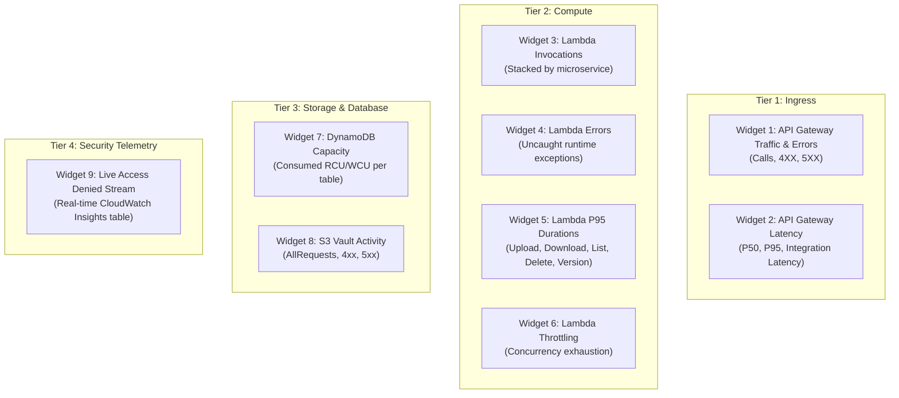

# CloudWatch Unified Monitoring Dashboard

## 1. Dashboard Overview

The **`SecureEmployeeVault-Production`** dashboard provides a single pane of glass for real-time operational health, security anomalies, API throughput, and infrastructure saturation across the Secure Employee Document Vault stack in AWS Region `us-east-2`.

* **Dashboard Name**: `SecureEmployeeVault-Production`
* **Region**: `us-east-2`
* **AWS Console URL**: [https://us-east-2.console.aws.amazon.com/cloudwatch/home?region=us-east-2#dashboards/dashboard/SecureEmployeeVault-Production](https://us-east-2.console.aws.amazon.com/cloudwatch/home?region=us-east-2#dashboards/dashboard/SecureEmployeeVault-Production)
* **Deployment Command**:
  ```powershell
  aws cloudwatch put-dashboard `
    --dashboard-name SecureEmployeeVault-Production `
    --dashboard-body file://monitoring/cloudwatch-dashboard.json `
    --region us-east-2
  ```

---

## 2. Widget Inventory & Metric Definitions

The dashboard contains 9 purpose-built widgets organized across 5 monitoring tiers:



### Detailed Widget Specifications

| Widget ID | Title | Metrics & Statistics | Operational Purpose & Normal Thresholds |
|---|---|---|---|
| **W1** | API Gateway Traffic & Error Counts | `AWS/ApiGateway` `Count`, `4XXError`, `5XXError` (Sum, 5m period) | Tracks overall traffic and error ratios. Normal 4XX: <2% (mostly expired tokens); Normal 5XX: 0%. |
| **W2** | API Gateway End-to-End Latency | `AWS/ApiGateway` `Latency` (P50, P95), `IntegrationLatency` (P95) | Differentiates API Gateway network overhead from Lambda execution. Normal P95: <150ms. |
| **W3** | Lambda Invocations by Function | `AWS/Lambda` `Invocations` (Sum, 5m, Stacked) across 5 handlers | Observes traffic distribution across operations (typically List > Download > Upload > Version > Delete). |
| **W4** | Lambda Errors by Microservice | `AWS/Lambda` `Errors` (Sum, 5m) across all 5 functions | Detects uncaught runtime failures, DynamoDB timeouts, or KMS failures. Normal: 0. |
| **W5** | Lambda P95 Duration by Function | `AWS/Lambda` `Duration` (P95, 5m) | Identifies performance regressions and cold start spikes. Normal: <100ms warm. |
| **W6** | Lambda Concurrency Throttles | `AWS/Lambda` `Throttles` (Sum, 5m) | Detects concurrency pool exhaustion. Normal: 0. |
| **W7** | DynamoDB Capacity Consumption | `AWS/DynamoDB` `ConsumedReadCapacityUnits`, `ConsumedWriteCapacityUnits` (Sum) | Monitors billing utilization for on-demand tables (`document_metadata`, `audit_log`, `employee_directory`). |
| **W8** | S3 Vault Bucket Requests & Errors | `AWS/S3` `AllRequests`, `4xxErrors`, `5xxErrors` | Monitors encrypted vault storage access and potential pre-signed URL expiry issues. |
| **W9** | Live Security & Access Denied Stream | CloudWatch Insights query across all 5 Lambda log groups | Surfaces unauthorized downloads, unauthorized deletions, and traversal attempts in near real-time. |

---

## 3. Viewing & Exporting

To view the dashboard in the AWS CLI or inspect its JSON schema:
```powershell
aws cloudwatch get-dashboard `
  --dashboard-name SecureEmployeeVault-Production `
  --region us-east-2 `
  --query 'DashboardBody' `
  --output text | ConvertFrom-Json
```

To capture screenshots:
1. Navigate to the dashboard URL in AWS Management Console.
2. Select time range (e.g. `1h` or `3h`).
3. Save screenshot to `docs/screenshots/dashboard.png` (Note: in automated environments without visual capture tools, dashboard configuration JSON in `monitoring/cloudwatch-dashboard.json` serves as the authoritative deployment artifact).
