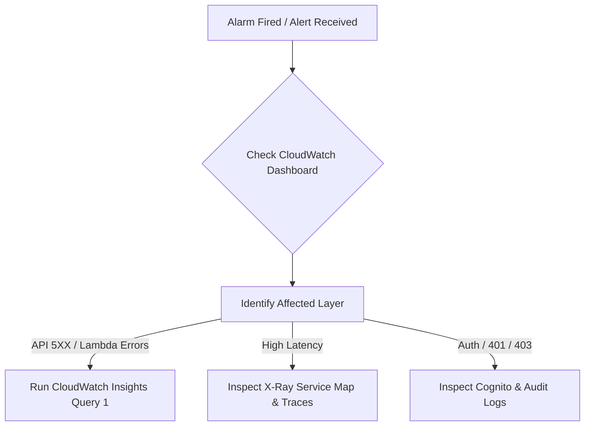

# Operational Incident Runbook: Secure Employee Document Vault

This runbook provides actionable procedures for on-call engineers responding to operational incidents, performance regressions, and security alerts for the Secure Employee Document Vault in AWS Region `us-east-2`.

---

## 1. Quick Reference & System Metadata

| Attribute | Production Value |
|---|---|
| **AWS Account ID** | `210452150784` |
| **AWS Region** | `us-east-2` |
| **API Gateway URL** | `https://gk6sav3uah.execute-api.us-east-2.amazonaws.com/prod` |
| **Cognito User Pool ID** | `us-east-2_xlMw5oMEz` |
| **CloudWatch Dashboard** | [SecureEmployeeVault-Production](https://us-east-2.console.aws.amazon.com/cloudwatch/home?region=us-east-2#dashboards/dashboard/SecureEmployeeVault-Production) |
| **SNS Alert Topic** | `arn:aws:sns:us-east-2:210452150784:secure-employee-vault-alerts` |

---

## 2. Severity Classification Matrix

| Severity | Definition | Target Response (MTTA) | Target Mitigation (MTTR) | Notification Channels |
|---|---|---|---|---|
| **SEV-1 (Critical)** | Entire API down, S3 vault inaccessible, data corruption, or active security breach / unauthorized data leak. | < 5 minutes | < 30 minutes | PagerDuty + SMS + Executive Slack channel (`#incident-vault-sev1`) |
| **SEV-2 (Major)** | P95 latency > 3000ms, error rate > 5%, single microservice failing (e.g. Upload down while Download works). | < 15 minutes | < 2 hours | PagerDuty + Engineering Slack (`#vault-ops`) |
| **SEV-3 (Minor)** | Intermittent client errors, isolated authorization denials, elevated cold starts. | < 1 business hour | < 1 business day | Email / Jira Ops Ticket |

---

## 3. First 5 Minutes: Initial Triage Checklist



1. **Acknowledge Alert** on PagerDuty/SNS to halt escalation.
2. **Open Dashboard**: [SecureEmployeeVault-Production](https://us-east-2.console.aws.amazon.com/cloudwatch/home?region=us-east-2#dashboards/dashboard/SecureEmployeeVault-Production).
3. **Determine Scope**:
   * Are all endpoints failing or just one (`/upload`, `/download`, `/files`, `/delete`, `/versions`)?
   * Is API Gateway returning 5XX (gateway timeout / integration failure) or 4XX (client / auth failure)?
   * Are Lambda errors spiking or is DynamoDB / S3 throttling?
4. **Post Incident Declaration**:
   `[INCIDENT-OPEN] SEV-<X> declared for Secure Employee Vault. Investigating <symptom>. IC: @oncall-engineer`

---

## 4. Diagnostic Procedures

### 4.1 Alarm: `SecureEmployeeVault-HighErrorRate` (> 5% Errors)

1. **Execute CloudWatch Logs Insights Query across all 5 Lambdas**:
   ```sql
   fields @timestamp, operation, status, error_type, error_message, employeeId
   | filter status = "ERROR" or ispresent(error_type)
   | stats count(*) as err_count by operation, error_type, error_message
   | sort err_count desc
   ```
2. **Check for Uncaught Python Exceptions**:
   ```sql
   fields @timestamp, @log, @message
   | filter @message like /(?i)(Traceback|Exception|KeyError|ClientError)/
   | sort @timestamp desc
   | limit 20
   ```
3. **Isolate Common Causes**:
   * **KMS Access Denied**: Check if KMS key policy was modified or key disabled:
     `aws kms describe-key --key-id 031e72ea-c2db-4b60-8717-80f83bad5188 --region us-east-2`
   * **DynamoDB Outage / Throttles**: Check `TransactionConflictExceptions` or table status:
     `aws dynamodb describe-table --table-name document_metadata --region us-east-2 --query Table.TableStatus`
   * **Corrupted Payload / Bad Release**: Identify the latest Lambda deployment timestamp and diff with Git tags.

---

### 4.2 Alarm: `SecureEmployeeVault-HighP95Latency` (> 3000ms Latency)

1. **Inspect AWS X-Ray Traces**:
   * Go to AWS X-Ray Console -> Traces.
   * Filter: `service("gk6sav3uah") AND responsetime > 3`
   * Inspect the slowest subsegment:
     - If **Lambda Initialization**: Cold start issue or VPC ENI attachment delay.
     - If **DynamoDB Subsegment**: Check for unindexed table scan instead of GSI query.
     - If **S3 Subsegment**: Check network transfer time or S3 rate limits.
2. **Check Lambda Concurrency Throttling**:
   ```powershell
   aws cloudwatch get-metric-data `
     --metric-data-queries file://monitoring/check-throttles.json `
     --start-time (Get-Date).AddHours(-1).ToString("yyyy-MM-ddTHH:mm:ssZ") `
     --end-time (Get-Date).ToString("yyyy-MM-ddTHH:mm:ssZ") `
     --region us-east-2
   ```

---

### 4.3 High 401/403 Spikes (Authentication & Access Denied Anomalies)

1. **Check Cognito User Pool Availability**:
   ```powershell
   aws cognito-idp describe-user-pool `
     --user-pool-id us-east-2_xlMw5oMEz `
     --region us-east-2 `
     --query 'UserPool.Status'
   ```
2. **Review Access Denied Stream in Dashboard Widget 9**:
   ```sql
   fields @timestamp, employeeId, role, operation, resource, error_message, sourceIp
   | filter status = "DENIED"
   | sort @timestamp desc
   | limit 50
   ```
   * If concentrated on a single IP: Possible credential stuffing or brute-force attack.
   * If widespread across all users: API Gateway authorizer cache misconfiguration or token signature issue.

---

## 5. Recovery Procedures & Playbooks

### Playbook 1: Rollback Lambda Code to Last Known Good Version
If a bad deployment caused the regression:
```powershell
# Check versions
aws lambda list-versions-by-function --function-name EmployeeVaultUpload --region us-east-2

# Redeploy previous stable bundle
aws lambda update-function-code `
  --function-name EmployeeVaultUpload `
  --zip-file fileb://dist/EmployeeVaultUpload-backup.zip `
  --region us-east-2
```

### Playbook 2: Relieve Lambda Concurrency / Throttling
Increase reserved concurrency or remove throttling limits:
```powershell
aws lambda put-function-concurrency `
  --function-name EmployeeVaultDownload `
  --reserved-concurrent-executions 100 `
  --region us-east-2
```

### Playbook 3: Temporary S3 Bucket / KMS Policy Recovery
If bucket access errors occur, verify KMS grants and bucket policy:
```powershell
aws s3api get-bucket-policy `
  --bucket employee-document-vault-210452150784-us-east-2 `
  --region us-east-2
```

---

## 6. Escalation Matrix

| Role | Contact | Escalation Trigger |
|---|---|---|
| **Primary On-Call** | On-call Engineer | Initial alert receipt (0 - 15 mins) |
| **Secondary (Lead Architect)** | Lead Cloud Engineer | SEV-1 or SEV-2 unmitigated after 20 mins |
| **Security Officer** | CISO / AppSec Lead | Any breach, unauthorized document exfiltration, or KMS key tampering |
| **AWS Premium Support** | AWS Enterprise Support (Case severity: Critical) | Underlying AWS service outage (Cognito, Lambda, S3 regional issues) |

---

## 7. Post-Incident Review (PIR) Template

```markdown
# Incident Post-Mortem: [INCIDENT-TITLE]
* **Date**: YYYY-MM-DD
* **Severity**: SEV-1 / SEV-2 / SEV-3
* **Duration**: XX minutes (Start: HH:MM UTC, End: HH:MM UTC)
* **Incident Commander**: [Name]

### Impact
* Number of users affected:
* Failed requests (% and absolute count):
* Any data loss or compliance violation? (Yes/No)

### Timeline (UTC)
* HH:MM - Alarm fired
* HH:MM - Engineer acknowledged
* HH:MM - Root cause identified
* HH:MM - Mitigation applied
* HH:MM - Verification complete and incident closed

### Root Cause Analysis (5 Whys)
1. Why did the service fail?
2. Why ...?
3. Why ...?
4. Why ...?
5. Why ...?

### Corrective Actions & Preventative Tasks
- [ ] Task 1 (Owner, Due Date)
- [ ] Task 2 (Owner, Due Date)
```
