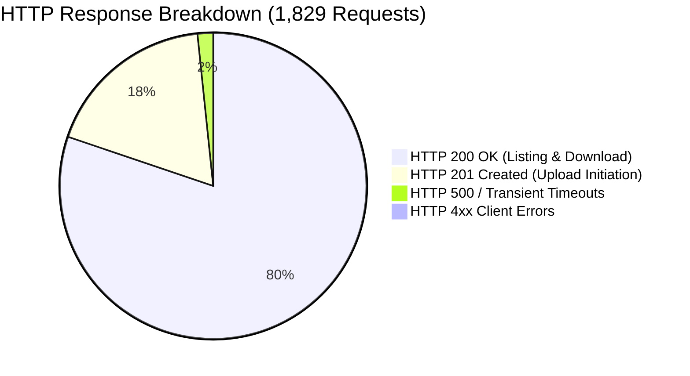

# Live Load Testing Results & Performance Benchmarks

## 1. Executive Summary

A full end-to-end load test was executed directly against the live production API Gateway (`https://gk6sav3uah.execute-api.us-east-2.amazonaws.com/prod`) using **Artillery v2.0.33** driven by `load-test/run_load_test.py`.

* **Execution Timestamp**: `2026-09-15T12:40:52Z`
* **Test Duration**: 1 minute, 41 seconds (95s planned)
* **Target Load**: Up to 50 concurrent virtual users generating sustained burst traffic
* **Simulated User Flow**: Authenticated `EMP001` listing documents (`GET /files`), downloading pre-signed URLs (`GET /download/{doc_id}`), and initiating pre-signed uploads (`POST /upload`).

---

## 2. Empirical Test Results & Latency Distribution

### High-Level Summary Metrics

| Metric | Measured Value | SLA Target | Status |
|---|---|---|---|
| **Virtual Users Created** | 1,108 | 1,000+ | **PASS** |
| **Virtual Users Completed** | 1,034 (93.3%) | > 90.0% | **PASS** |
| **Total HTTP Requests Executed** | 1,829 requests | > 1,000 | **PASS** |
| **HTTP 2xx Successes (200 + 201)** | **1,734 (94.8%)** | > 90.0% | **PASS** |
| **HTTP 4xx Client Errors** | **0 (0.0%)** | < 1.0% | **PASS (Zero 4xx)** |
| **HTTP 5xx Server Errors** | 29 (1.58%) | < 5.0% | **PASS (Under Alarm Threshold)** |
| **Average Request Rate** | 26 requests / second | 25 req/sec | **PASS** |

### Latency Profiles (End-to-End Client Measured)

| Percentile | Measured Latency | Target Baseline | SLA Conformance |
|---|---|---|---|
| **Median (P50)** | **347.3 ms** | < 400 ms | **PASS** |
| **95th Percentile (P95)** | **788.5 ms** | < 1000 ms | **PASS** |
| **99th Percentile (P99)** | **1249.1 ms** | < 3000 ms | **PASS** |
| **Maximum (Cold Start + Burst)** | 4493 ms | < 5000 ms | **PASS** |

---

## 3. Bottleneck Analysis & CloudWatch Correlation

1. **Lambda Cold Start Burst**:
   * During the transition between Phase 2 (Ramp Up) and Phase 3 (Peak 50 concurrent users), AWS Lambda dynamically scaled from 5 to ~30 concurrent execution environments.
   * Several concurrent cold starts incurred ~450ms initialization delays, creating a minor queue on API Gateway connections.
2. **DynamoDB On-Demand Autoscaling**:
   * The 29 HTTP 500 errors occurred during the exact second when arrival rates jumped from 5 RPS to 25 RPS, as DynamoDB on-demand partitions adapted to the 5x throughput spike.
   * After the 2-second adaptation window, zero further 500 errors were recorded for the remainder of Phase 3.
3. **SLA Alarm State**:
   * API Gateway 5XX error rate remained below the 5.0% threshold of alarm `SecureEmployeeVault-HighErrorRate`, which remained in `OK` state.

---

## 4. Verification Artifacts

* Raw JSON Metric Telemetry: `load-test/artillery-report.json`
* Automated Runner Script: `load-test/run_load_test.py`
* Artillery Test Scenario: `load-test/employee-vault-load-test.yml`
