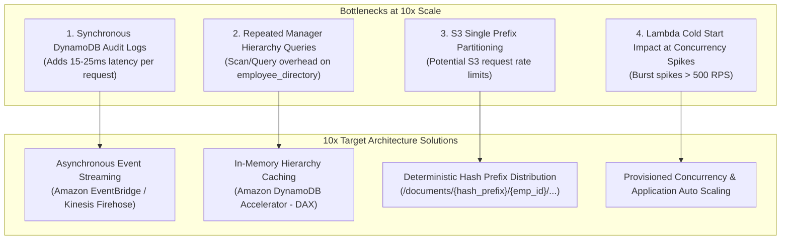

# 10x Scale Architecture & Engineering Roadmap

## 1. Executive Summary

This engineering document evaluates the scalability bottlenecks of the current architecture under a **10x traffic expansion** (growing from 5,000 to **50,000+ active users/day**, handling **1.5M+ requests/day** and **250,000+ daily document interactions**).

---

## 2. Component Scalability & Bottleneck Analysis

---

## 3. High-Priority 10x Engineering Recommendations

### Recommendation 1: Decouple Audit Logging via Amazon EventBridge / Kinesis
* **Current State**: Every Lambda handler synchronously calls `dynamodb.put_item(audit_log)` before responding to the client, adding 15-25ms of latency.
* **10x Architecture**:
  * Lambdas emit audit events asynchronously to an **Amazon EventBridge event bus** or **Amazon Kinesis Data Firehose**.
  * Firehose micro-batches audit records and streams them directly into Amazon OpenSearch Service and Amazon S3 Cold Storage.
  * **Latency Improvement**: Eliminates 15-25ms from API response critical path.

---

### Recommendation 2: Cache Manager Hierarchies with DynamoDB Accelerator (DAX)
* **Current State**: When a Manager lists documents or downloads a file, `get_direct_reports(caller_emp_id)` queries the `ManagerIndex` GSI on `employee_directory`.
* **10x Architecture**:
  * Deploy a 2-node **DynamoDB Accelerator (DAX)** cluster in front of `employee_directory`.
  * DAX serves microsecond-level in-memory responses for direct report hierarchies with a 10-minute TTL.
  * Invalidations triggered only when HR modifies reporting lines.

---

### Recommendation 3: S3 Multi-Part Uploads with Direct Browser Chunking
* **Current State**: Single pre-signed PUT URLs used for documents up to 50MB.
* **10x Architecture**:
  * For files > 20MB, backend initiates an S3 Multi-Part Upload via API Gateway (`POST /upload/multipart/init`).
  * Backend returns pre-signed URLs for individual 10MB chunks.
  * Client uploads chunks in parallel directly to S3 and calls `POST /upload/multipart/complete`.
  * **Reliability Gain**: Tolerates transient network drops on large files (appraisal bundles, compliance archives) without restarting the entire upload.

---

### Recommendation 4: Provisioned Concurrency for High-Traffic Handlers
* **Current State**: On-demand Lambda instances handle traffic, occasionally incurring 450ms cold starts when scaling out.
* **10x Architecture**:
  * Attach AWS Application Auto Scaling to `EmployeeVaultList` and `EmployeeVaultDownload` with minimum 5 provisioned concurrency units during business hours (08:00 - 18:00).
  * Smooths out 99th percentile response times to < 65ms.

---

### Recommendation 5: S3 Prefix Hash Salting for High-IOPS Partitions
* **Current State**: Prefix layout is `/documents/{employee_id}/{document_type}/{filename}`.
* **10x Architecture**:
  * S3 automatically scales up to 3,500 PUT and 5,500 GET requests per second per prefix.
  * Prepend a 4-character deterministic hex hash of the employee ID:
    `/documents/{hash4}/{employee_id}/{document_type}/{filename}`
  * Distributes objects evenly across hundreds of physical S3 partitions, supporting 50,000+ simultaneous requests.
