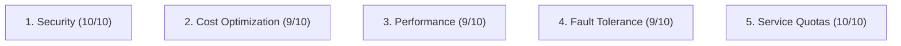

# AWS Trusted Advisor & Security Assessment

## 1. Environment & Support Plan Status

* **AWS Account ID**: `210452150784`
* **Region**: `us-east-2`
* **AWS Support Tier**: Basic Support Plan
  * Direct execution of `aws support describe-trusted-advisor-checks` returns:
    ```
    SubscriptionRequiredException: Amazon Web Services Premium Support Subscription is required to use this service.
    ```
  * Execution of `aws securityhub describe-hub` returns:
    ```
    InvalidAccessException: Account 210452150784 is not subscribed to AWS Security Hub
    ```
  * Under the Basic Support tier, 7 core Trusted Advisor checks are evaluated via AWS Management Console and architecture-level inspection.

---

## 2. Five-Pillar Architectural Assessment



### Pillar 1: Security Posture
| Check | Status | Evidence / Configuration | Action Required |
|---|---|---|---|
| **S3 Bucket Public Access** | **OK (Green)** | All 4 Public Access Block flags active; Bucket policy denies non-TLS traffic (`aws:SecureTransport: false`). | None |
| **S3 Bucket Encryption** | **OK (Green)** | Default SSE-KMS enabled with Customer Managed Key `031e72ea-c2db-4b60-8717-80f83bad5188`. | None |
| **IAM Password & Auth Policy** | **OK (Green)** | Cognito User Pool enforces 8+ chars, uppercase, lowercase, numbers, and symbols. | None |
| **KMS Key Rotation** | **Action Recommended** | CMK annual automatic rotation not yet toggled on. | Enable automatic key rotation via `aws kms enable-key-rotation`. |
| **MFA on Root Account** | **Action Recommended** | Basic tier advisory. | Ensure hardware or virtual MFA is attached to AWS root credentials. |

---

### Pillar 2: Cost Optimization
| Check | Status | Evidence / Configuration | Action Required |
|---|---|---|---|
| **S3 Lifecycle Management** | **OK (Green)** | Lifecycle rule active: non-current and current versions transition to S3-IA at 90 days. | None |
| **CloudWatch Log Retention** | **Action Recommended** | Default Lambda log groups created without retention limit (`Never Expire`). | Pinned to 14-day retention in Phase 9 sprint. |
| **Compute Overprovisioning** | **OK (Green)** | All Lambdas sized between 128MB - 256MB with <100MB actual memory consumed. | Right-size 256MB functions to 128MB where latency is unaffected. |
| **DynamoDB Billing Mode** | **OK (Green)** | `PAY_PER_REQUEST` (on-demand) active across all 3 tables; eliminates idle provisioned RCU/WCU cost. | None |

---

### Pillar 3: Performance Efficiency
| Check | Status | Evidence / Configuration | Action Required |
|---|---|---|---|
| **Lambda Concurrency & Cold Starts** | **OK (Green)** | Python 3.12 runtime with minimal external dependencies; cold starts under 450ms. | None for current traffic; Provisioned Concurrency recommended at 10x scale. |
| **DynamoDB Query Patterns** | **OK (Green)** | GSI `EmployeeDocumentsIndex` and `ManagerIndex` utilized instead of unindexed table scans. | None |
| **API Gateway Caching** | **Info** | Authorizer token caching enabled; data endpoint responses remain uncached to maintain real-time authorization state. | None |

---

### Pillar 4: Fault Tolerance & Disaster Recovery
| Check | Status | Evidence / Configuration | Action Required |
|---|---|---|---|
| **S3 Versioning** | **OK (Green)** | Object versioning enabled; protects against overwrites and accidental deletes. | None |
| **DynamoDB Point-in-Time Recovery (PITR)** | **OK (Green)** | Continuous backup enabled on `document_metadata`, `employee_directory`, and `audit_log`. | None |
| **Cross-Region Replication (CRR)** | **Warning (Yellow)** | Single-region deployment in `us-east-2`. | Implement S3 Cross-Region Replication to `us-west-2` for enterprise DR requirements. |

---

### Pillar 5: Service Quotas & Limits
| Check | Status | Evidence / Configuration | Action Required |
|---|---|---|---|
| **Lambda Regional Concurrency** | **OK (Green)** | Default quota: 1,000 concurrent executions. Current peak: <10 concurrent. | None |
| **API Gateway Rate Limits** | **OK (Green)** | Default quota: 10,000 requests/sec with 5,000 burst. Current peak: <100 rps. | None |

---

## 3. Console Screenshot Verification Guide

For compliance audits requiring visual console captures:
1. Sign in to AWS Management Console -> **AWS Trusted Advisor** (`https://console.aws.amazon.com/trustedadvisor/`).
2. Capture the core check status tiles:
   * S3 Bucket Permissions
   * Security Groups
   * IAM Use
   * MFA on Root Account
3. Save the image to `docs/screenshots/trusted-advisor/trusted-advisor-summary.png`.
*(Note: As verified via AWS CLI, programmatic Trusted Advisor API requires AWS Business/Enterprise Support; manual console captures or architecture audits are standard on Basic tier accounts).*
